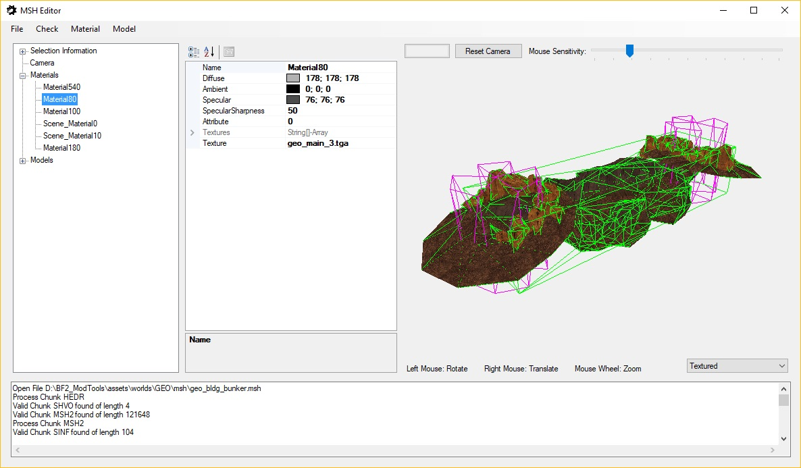
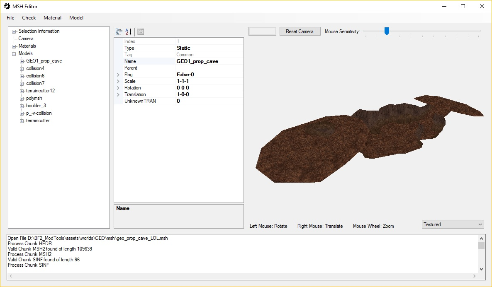

# MSHEditor
Simple Editor to grab and modify information from a Star Wars Battlefront 2 (2005) Mesh (*.msh) File. 
Basically, right now just a GUI-Wrapper for the MSH capabilities of [LibSWBF2](https://github.com/Ben1138/LibSWBF2).

